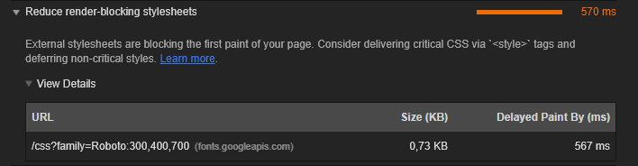

# performance-matters-server-side
from 

## Getting started

Clone repository
```
git clone
```

Install dependencies
```
npm install
```

Start application
```
npm start
```

Standart port is 4000
```
localhost:4000
```

## Optimalisation

### Critical css
To optimise the speed of the page. The CSS is loaded in the head of the page instead having their own file. This is done, because instead of sending two request to the server, now there is just one request with all of the CSS to getting started.

### Render blocking CSS
To make this application nicer to look at, we are loading an external font from google. 

``` html
<link href="https://fonts.googleapis.com/css?family=Ubuntu:300,400,700" rel="stylesheet">
```

```css 
body{
        font-family: 'Ubuntu', sans-serif;
    }
```



When we first started we've put this request in head of the application, but this request is render blocking, which means the html will not load till the CSS is loaded. So to improve this, I've download the font to serve from our own server, then we call this font with the @font-face attribute. On top of this, we will add the font-display: swap attribute.

>swap: Instructs the browser to use the fallback font to display the text until the custom font has fully downloaded. [Geoff Graham](https://css-tricks.com/almanac/properties/f/font-display/)

```css
 @font-face {
    font-family: ExampleFont;
    src: url(./font/Ubuntu-R.ttf) format('ttf');
    font-display: swap;
}
```

## Service worker
We can improve our speed by caching the page and all of the assets that we need, so that instead of requesting for the assets, we will get it from the cache instead.

This is how long it takes till the server is sending something back. It takes normally 400ms till the first byte is on the client side.


We can takes tiss to 0, when we serve the file from the service worker


## Compression
We also can improve our performance by making the our file size smaller. To do that we're adding a compression algorithm after a request has been made. We're doing this with the [Compression](https://github.com/expressjs/compression) Tool. 

*without compression*


*with compression*


From 16.3 kb to 3.7 kb is a reduction of 22.7% file size. That is huge. We've also speed up the page by: 38%.

## Future perspective
Right now, we dont have any javascript on the client side. But in the future this can change. I suggest using ES6 module the make development easier and faster and this will translate to the overall cost of the project.

We're going to demo this by using our previous project: [Web App from Scratch](https://github.com/niyorn/wafs) - [Demo](https://niyorn.github.io/wafs/app/index.html)

This is what we have now, a total filze size of 3.57 kb. The disadvantage of this is that when loading the script, different request to the server must be made for all of the dependencies.


To tackle this, we can use a bundler tool. A tool for this can be: [Roll up](https://rollupjs.org/guide/en). Roll up will bundle all of our dependencies into a single file, but on top of that, it will also use a technique called three shaking.

>In addition to enabling the use of ES6 modules, Rollup also statically analyzes the code you are importing, and will exclude anything that isn't actually used. This allows you to build on top of existing tools and modules without adding extra dependencies or bloating the size of your project. - [Roll up](https://rollupjs.org/guide/en#tree-shaking)

Lets see the result:


As you can see the file size went from 3.57kb to 2.4kb that's a decrease of 23%. A really big change.

Also the time it takes to load the javascript file have also decrease significantly. It went from a ~ 140 ms to 25ms. A decrease of: ~ 82%. 


